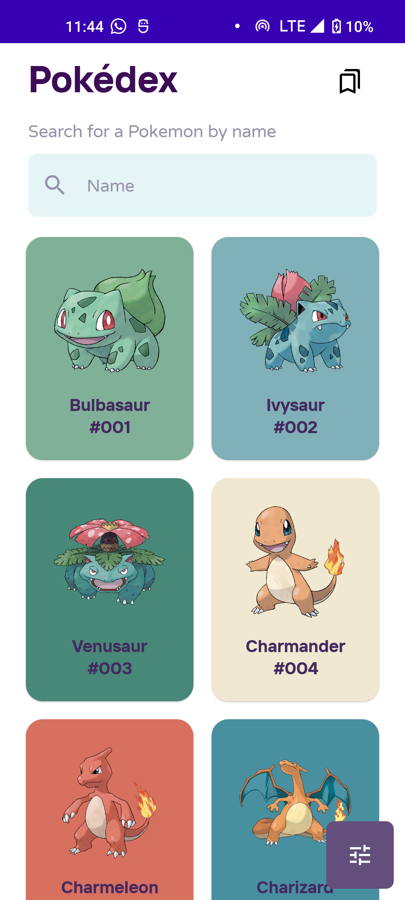
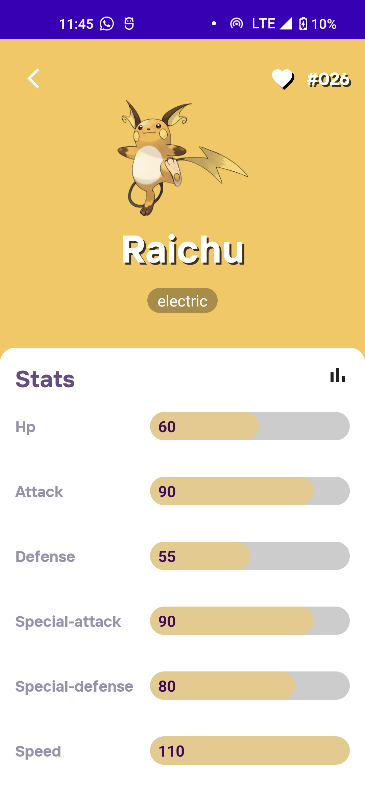
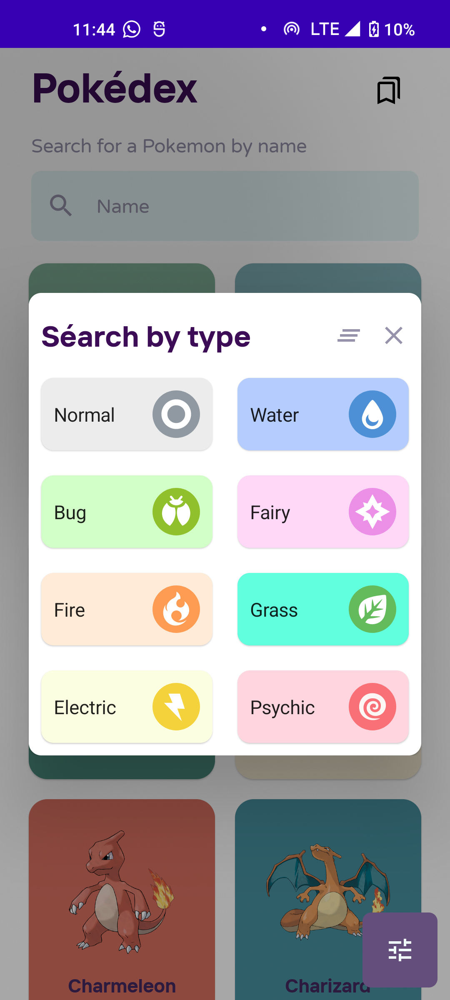
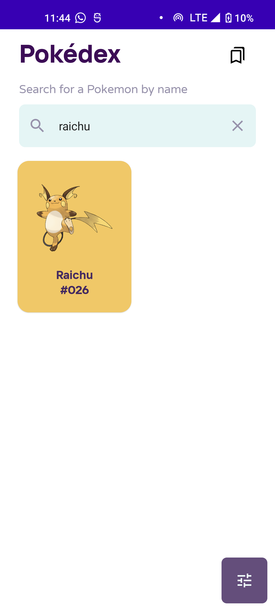

Pokedex is an android app made with Jetpack compose and kotlin that fetches pokemons data

## Made with the use of Modern Android development tools:

- [Kotlin](https://developer.android.com/kotlin)

- [Jetpack Compose](https://developer.android.com/jetpack/compose)

- [Retrofit](https://square.github.io/retrofit/)

- [MVVM](https://developer.android.com/jetpack/guide)

- [Dagger-Hilt](https://developer.android.com/training/dependency-injection/hilt-android) 

- [Coroutines](https://developer.android.com/kotlin/coroutines)

- [Flows](https://developer.android.com/kotlin/flow)

- [Room Database](https://developer.android.com/topic/libraries/architecture/datastore)

### API Used
* [PokeApi](https://pokeapi.co/)

## Features:

- Search for a pokemon

- Save favourite pokemons

- Filter pokemons by type

## Screenshots:

<table>
  <tr>
     <td>Homescreen</td>
     <td>Detail screen</td>
  </tr>
  <tr>
    <td></td>
    <td></td> 
  </tr>
 </table>

<table>
  <tr>
     <td>Apply Filter</td>
     <td>Search pokemon</td>
  </tr>
  <tr>
    <td></td>
    <td></td>
  </tr>
 </table>
